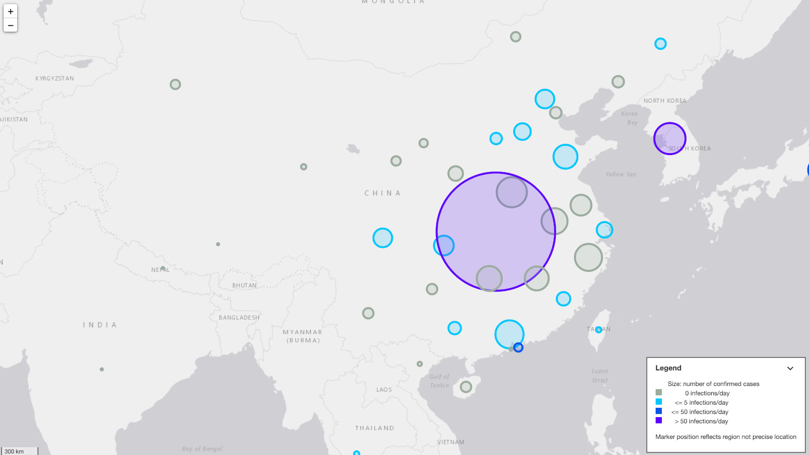

[Basic web application](https://coronavirus.dreamonward.com/) to visualize Corona virus spread over time.

[](https://coronavirus.dreamonward.com/)

See [blog post](https://dreamonward.com/2020/02/28/coronavirus-spread-animation/) for motivation and design considerations.

# Data

[Novel Coronavirus (COVID-19) Cases](https://github.com/CSSEGISandData/COVID-19) by JHU CSSE.

Specifically: `csse_covid_19_data/csse_covid_19_time_series/`

## Running app

Install the dependencies.

```bash
npm install
```

Run server

```bash
npm run dev
```

Navigate to [localhost:5000](http://localhost:5000).


## Building and running in production mode

To create an optimised version of the app:

```bash
npm run build
```

You can run the newly built app with `npm run start`. This uses [sirv](https://github.com/lukeed/sirv), which is included in your package.json's `dependencies` so that the app will work when you deploy to platforms like [Heroku](https://heroku.com).


